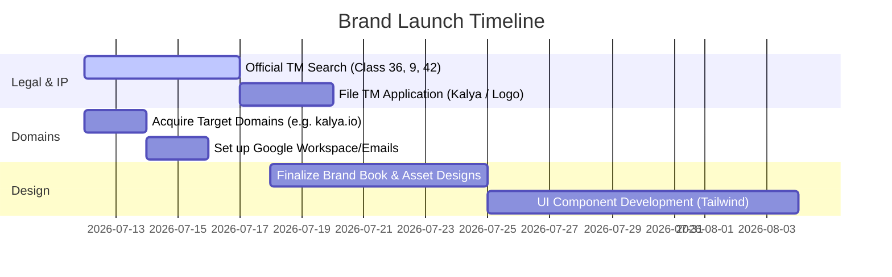

# Brand Blueprint: Kalya (कल्य)
*The Modern Command Center for Personal Finance & Tomorrow-Readiness*

---

## 1. Brand Concept & Core Philosophy

**Kalya** represents the convergence of financial health and future security. In a market crowded with transactional, hyper-active wealth calculators, Kalya positions itself as a calm, authoritative guardian that ensures its users are financially fit and prepared for whatever tomorrow brings.

### The Sanskrit Origin
* **Syllables:** Ka-lya (कल्य)
* **Literal Translations:** 
  1. *Healthy, fit, or in sound condition.*
  2. *Ready for tomorrow, dawn, or the coming day.*
  3. *A state of wellness and preparation.*

### The Brand Metaphor
Personal finance is not just about tracking expenses; it is about building a secure, resilient foundation. **Kalya** reframes the daily act of budgeting and net worth monitoring from a chore into a lifestyle of "financial fitness." Just as physical fitness ensures long-term bodily health, financial fitness ensures long-term peace of mind.

---

## 2. Target Audience & Positioning

### The Target Persona: "The Conscious Builder"
* **Demographics:** Young professionals, salaried individuals, and early-stage families in India (ages 25–45).
* **Their Need:** They earn well but have fragmented assets (equity, mutual funds, gold) and liabilities (home loans, car EMIs, credit cards). They want to secure their retirement (EPF, PPF, NPS) and protect their family with the right insurance, but feel overwhelmed by multiple dashboards.
* **Their Pain Point:** Existing apps feel either too corporate/boring (old-school banking portals) or too playful and transactional (credit card reward trackers). They need a platform that matches their desire for premium security and sophisticated, automated guidance.

### Competitive Grid
```
                       [Trustworthy / Secure]
                                 |
                                 |   * KALYA (Target Position)
   * Zerodha                     |
                                 |
[Complex/Analytical] ------------+------------ [Simple / Accessible]
                                 |
                                 |   * Groww
                                 |
                                 |   * Fi / Jupiter
                       [Playful / Transactional]
```

---

## 3. Product-to-Name Mapping
How the name **Kalya** directly mirrors the key features of the application:

* **Income, Expenses & Budgets ("Daily Fitness"):**
  * *Feature:* Automated expense categorization, alerts for overspending, and bill due dates.
  * *Naming Alignment:* Kalya represents the daily discipline of keeping cash flow "healthy" and in equilibrium.
* **Assets & Liabilities ("The Balance"):**
  * *Feature:* Consolidated tracking of physical gold, silver, equity, loans, and EMIs.
  * *Naming Alignment:* Balance sheet wellness. Kalya is the index that indicates whether your net worth trend is ascending healthily.
* **Retirement & Insurance ("Ready for Tomorrow"):**
  * *Feature:* Integration of long-term reserves (EPF, PPF, NPS) and active insurance policies.
  * *Naming Alignment:* The literal Sanskrit translation of "ready for tomorrow/dawn." It assures users that their future is shielded and secure.

---

## 4. Visual Identity & Design Language

The visual identity of Kalya should evoke **sophisticated security, organic growth, and absolute clarity**.

### Color Palette
* **Primary Deep Emerald (#0D3E26):** Symbolizes growth, wealth, and traditional trust. It feels premium and calm, moving away from standard fintech blues.
* **Secondary Satin Gold (#D4AF37):** Evokes prosperity, gold/silver assets, and premium quality. Used for highlights, goal achievements, and positive trends.
* **Neutral Off-White/Alabaster (#F9F8F6):** Provides a clean, minimalist background that keeps the interface feeling spacious and calm.
* **Alert Slate (#4E5D6C):** Used for warnings, EMI due dates, and liabilities, keeping notifications clear but non-alarmist.

### Typography
* **Primary (Headings):** *Outfit* or *Playfair Display* (light weight) – yields a premium, sophisticated editorial look.
* **Body Text:** *Inter* or *DM Sans* – highly legible, clean, and modern for financial numbers and tables.

### Logo & Iconography Concept
* **Icon:** A minimalist, stylized leaf that doubles as an ascending graph line or a compass pointer pointing towards the top-right. This blends the organic growth of "Vriksha" with the upward ascent of net worth.
* **Typography:** Lowercase, elegant sans-serif lettering: `kalya` or `kalya.finance`.

---

## 5. Tone & Brand Voice Guidelines

To handle sensitive retirement and asset data, the tone must feel **expert yet accessible, calm, and empowering**.

| What We Are | What We Are Not | Why |
| :--- | :--- | :--- |
| **Trustworthy & Grounded** | Boring or bureaucratic | We deal with retirement funds; users must trust us with their life savings, but we speak in plain, modern language. |
| **Clear & Instructive** | Hyper-analytical or confusing | We simplify complex portfolios into actionable, automated insights rather than throwing raw spreadsheets at the user. |
| **Empowering & Calm** | Panic-inducing or loud | If a user overspends or an EMI is due, we send a helpful, timely alert rather than an alarmist notification. |
| **Modern & Premium** | Overly playful or game-like | We do not treat investing or debt-clearance like a mobile game. We treat it as a path to financial freedom. |

---

## 6. Tagline Library

* **The Core Promise (Best for App Store / Homepage):**
  * *"Kalya: Ready for tomorrow."*
  * *"Consolidate your wealth. Secure your tomorrow."*
* **The Fitness Metaphor (Best for Marketing / Campaigns):**
  * *"Your financial fitness command center."*
  * *"Daily clarity. Lifetime security."*
* **The Insight Focus (Best for Notifications / Newsletters):**
  * *"Automated insights for a healthy net worth."*

---

## 7. Trademark & Domain Strategy (India focus)

### Trademark Registry (Class 36, 9, 42)
* **Status:** Excellent. There are no major active trademarks registered under Class 36 (Financial affairs, monetary affairs, insurance) for "Kalya" in India.
* **Precaution:** Avoid branding elements that overlap with "Kalyan Jewellers" or "Kalyan Mutual Fund" to prevent any phonetic confusion in marketing. Keep your spelling strictly **Kalya**.

### Domain Acquisition
* **Target TLDs:**
  * Primary: `kalya.io` or `kalya.finance`
  * Region-Specific: `kalya.in` or `kalya.co.in`
  * Action-Oriented (Highly Recommended for launch):
    * `getkalya.com`
    * `usekalya.com`
    * `mykalya.in`

---

## 8. Implementation Roadmap


